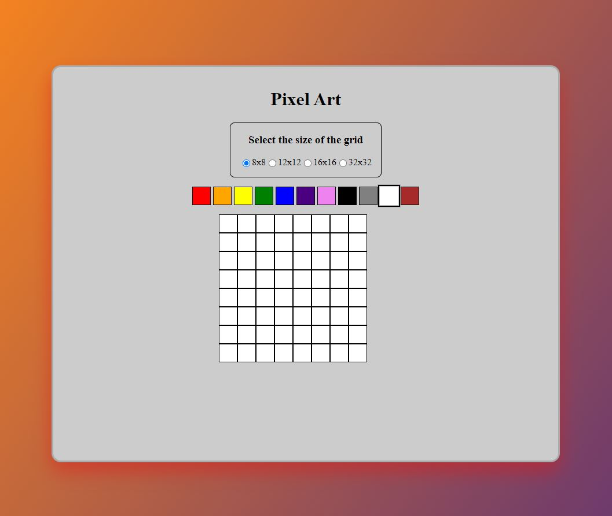

# Pixel Art App

## Demo

A demo of the app can be found at [DEMO: Pixel Art App](https://hugomenz.github.io/udg-challenge-junior-3/).

  

Welcome to the Pixel Art App! This app allows users to create pixel art designs by choosing colors from a palette and clicking on individual pixels to color them in. The app includes a range of grid sizes to choose from, including 8x8, 12x12, 16x16, and 32x32.

The app must also includes a paint bucket/fill tool that allows users to quickly fill in all neighboring pixels with the same color as the pixel they click on, but it is not implemented yet...

The app is implemented using Angular and makes use of Observables to allow for dynamic updates to the grid size. I chose to use Angular for this project because of my familiarity with the framework and its robust features for building single-page applications. Observables were a natural choice for handling updates to the grid size.

Maintainability was a key consideration in the development of this app. The codebase is well-structured and thoroughly documented, following best practices and coding style guidelines for Angular. The program flow is also easy to follow, making it easy for other developers to understand and build upon the code.

To access the code for this project, please visit the GitHub repository.
